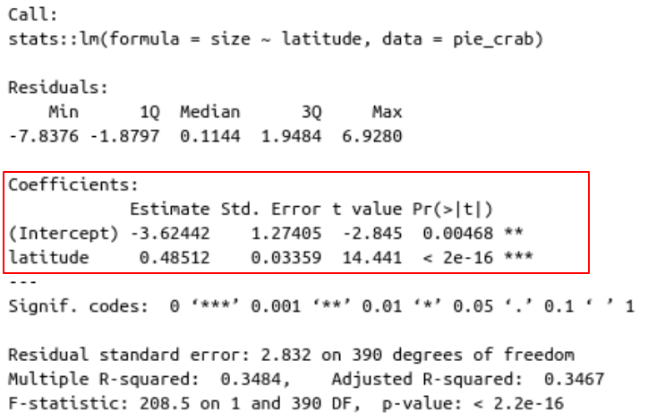
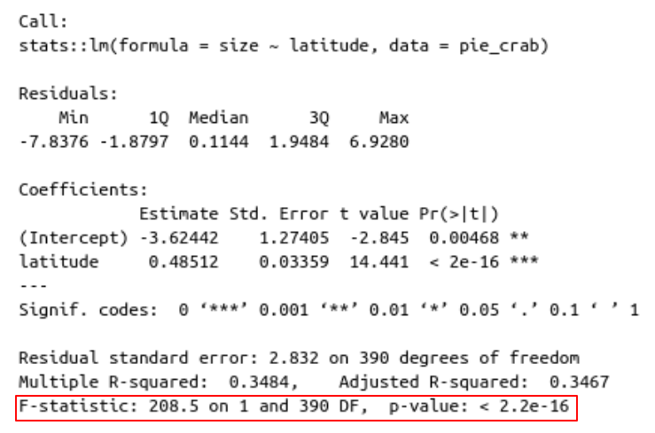
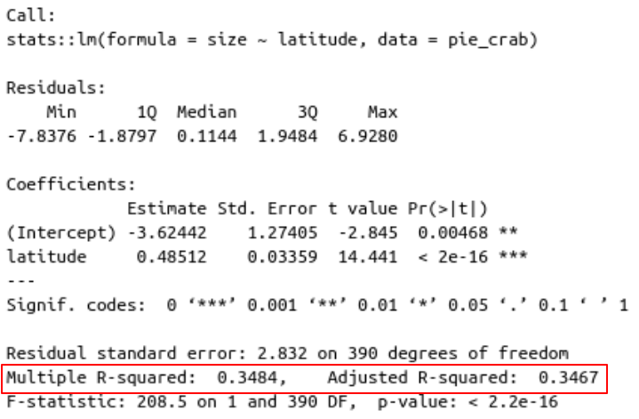

Dear Drs. Sztepanacz & Riskin,

I am writing to apply to the position of R software manual developer within the Department of Ecology and Evolutionary Biology at the University of Toronto. As a previous undergraduate in the EEB department, I am accutely aware of the need for this type of product in the undergraduate curriculum. Having spent the past 4 years working intensely in R, both in research and teaching capacities, I believe I have the skills and aptitude to build a dynamic, engaging, and adaptable product, usable in the department for years to come. 

I have significant experience teaching R to students at beginner to advanced levels. Along with colleagues at the University of Alberta, I developed and delivered multiple free, open-source workshop series introducing over 150 Biological Sciences students to both R and Python [https://colebrookson.github.io/r-for-biology/](https://colebrookson.github.io/r-for-biology/). I have developed and delivered workshops in reproducible research and coding practices for graduate students at the University of Alberta, and as the TA for Marine Population Ecology & Dynamics (an intensive field course held at Bamfield Marine Sciences Centre), I completely revamped the statistical and programming components of the courses, and built an open-source website to host the course online. I am a certified Data/Software Carpentries instructor, and completed graduate teaching and learning training through the University of Alberta's Faculty of Graduate Studies and Research. I have significant experience with a variety of other programming languages which lends context to my teaching approach to R (Julia, Python, MATLAB, Mathematica, C++, HTML, SQL, and JavaScript), and I am an expert in reproducible technologies such as version control with Git/GitHub, containerization with Docker & Singularity, and workflow implementation with bash, Make, Snakemake and others. In addition, I have experience building websites and working with RShiny to make teaching experiences more interactive and user-friendly. 

When I was first learning R as an EEB undergrad, I struggled significantly, which I think is why I am so incredibly passionate about computational education. The opportunity to contribute to this type of product would be the ultimate full-circle experience for me, allowing me to give back to the EEB community that formed me as a student & researcher, and offered me my first exposure to the wonderful world of R. 

As I am currently completing my MSc and will be on contract as an Ecological Data Analyst for the Kwikwasut'inuxw Haxwa'mis, 'Namgis, and Mamalilikulla First Nations until August 31, 2022, I would not be able to start the position until Aug 01, and would prefer a September 01 start date. However, I understand that might not fit with the timeline of this project, and would be very open to discussing possible solutions (i.e. part time earlier start dates).

My sincere thanks for your consideration,

Cole Brookson 

**Potential References** \
Dr. Marie-Josée Fortin - fortinmj@gmail.com \
Dr. Alexandra CD Davis - acdavis@ualberta.ca (Instructor at Bamfield)


\newpage

## One-page foray into regression analysis. 
Let's ask a biological question and answer it using regression. Regression, simply, is fitting a line through some points. We can think of this mathematically as $Y \sim \beta X,$ where our goal is to ask how $X$ explains $Y$, by estimating or "fitting" the value of the regression coefficient, $\beta$. For our example, let's test whether [Bergmann's Rule](https://www.britannica.com/science/Bergmanns-Rule) holds for within-species size patterns of fiddler's crabs. 

### Implementation 
So as usual, we will start by loading the required packages for this activity. To perform a simple linear regression, we can use the `stats` package which comes pre-loaded, but we'll also want the `tidyverse` package, to plot, and the `lterdatasampler` package, to load in some data for this task. \
```{r, warning=FALSE, echo=TRUE, message=FALSE}
# install packages if needed
#install.packages("tidyverse")
#remotes::install_github("lter/lterdatasampler")

# load in libraries
library(tidyverse)
library(lterdatasampler)
```
We will first fit the model, then look at the output using the `summary()` function.\
```{r, out.width = "200px"}
# we will use the lm() function from the stats package for this 
crab_mod = stats::lm(formula = size ~ latitude, # first specify the formula of the model
                     data = pie_crab) # specify the data source

# look at the output
summary(crab_mod)
```
There's lots of useful information in this output, but the first thing that we're *really* interested in is the estimate value for `latitude`. Here, the estimate can be interpreted as the $\beta$ value, and we can see that it is a positive value (so the slope of the regression line is positive), and we see that there is an associated p-value of <2e-16, which we can consider (for the purposes of this exercise) to be very significant, which then let's us reject our null hypothesis. 
\newpage

# Expanded (but still brief) foray into regression analysis

Let's explore some common ecological problems, and investigate how we can use linear regression to solve them. As usual, we will separate the statistical concept of regression, the domain, from the computational implementation. 

### Regression as Concept 

To refresh our memories, **regression** is a method of analysis we can use for hypothesis testing. At the simplest level, this idea of regression is simply *a measure of the relation between the mean value of one
variable, and the corresponding values of other variables*. It is most common to relate these to the ideas
of explanatory variables (denoted $X$) and the independent variable, $Y$. Since, as the name implies, linear
regression means simply fitting a straight line through some points, what we are actually doing in practice
most of the time, is finding the slope of that straight line, along with the y-intercept. Assuming for a moment
the y-intercept isn’t of interest, we can think of the simplest regression framework as being: $$Y \sim \beta X,$$ where our goal is to ask how $X$ explains $Y$, by estimating or "fitting" the value of the regression coefficient, $\beta$. 

### Implementation in R

So as usual, we will start by loading the required packages for this activity. To perform a simple linear regression, we can use the `stats` package which comes pre-loaded. We will want two additional packages: the `tidyverse` package, to plot our data, and the `lterdatasampler` package, to load in some data for this task. \
```{r, warning=FALSE, echo=TRUE, message=FALSE}
# install packages if needed
#install.packages("tidyverse")
#remotes::install_github("lter/lterdatasampler")

# load in libraries
library(tidyverse)
library(lterdatasampler)
```

Our example dataset we are using today is the `pie_crab` dataset, which includes data on the size of fiddler crabs' carapace width, alongside environmental variables. Let's first take a quick look at our dataset. \

```{r}
head(pie_crab)
```
\
To avoid p-hacking ourselves (see Appendix 1 for a review of p-hacking), we need to first develop a hypothesis that we're going to use our linear regression to test. A classic theory in ecology is [Bergmann's Rule](https://www.britannica.com/science/Bergmanns-Rule). Given the premise of the rule, we might expect relationship between size and latitude to happen within species. Let's test this with our fiddler crabs! 

:::: {.blackbox data-latex=""}
::: {.center data-latex=""}
**Null Hypothesis**
:::
To ensure we are going about this properly, let's state our biological null hypothesis.\

\begin{center} \textit{ Our null hypothesis is that there is NO significant positive relationship between latitude and the size of fiddler crabs.} \end{center} \
Note that this is a *directional* null/alternative hypothesis, which means we're not only stating that we believe there is a relationship, but the *direction* of that relationship. Now, let's think about what this means statistically. In our regression framework, remember we're thinking about **slope** of a line. A lack of a relationship is denoted by a slope of zero, but to reject our null hypothesis, we  need a *positive* relationship since Bergmann's Rule states that body size *increases* as temperature (and therefore latitude) decreases! We can *reject our null hypothesis* (recall we can never accept a hypothesis, only reject the null!!) if the slope of our regression line is significantly different than zero in the positive direction.
::::

If we relate these values to the expression for our simple linear model above ($Y \sim \beta X$), our data ($X$) will be the `latitude` variable in our dataset, our response variable ($Y$) will be `size`, and what we are estimating is $\beta$, the slope of the relationship. It turns our that in the implementation of this simple linear model, we can express it almost identically to how we have it written in math form. 

We will first fit the model, then look at the output using the `summary()` function.\
```{r}
# we will use the lm() function from the stats package for this 
crab_mod = stats::lm(formula = size ~ latitude, # first specify the formula of the model
                     data = pie_crab) # specify the data source

# look at the output
summary(crab_mod)
```
\newpage

There's a lot of useful information in this output that tells us about our test, so let's walk through it. \
```{r, out.width = "300px", echo=FALSE}

```

So here we can inspect the coefficients for our model fit. We can see the first value titled `(Intercept)`, but what we're *really* interested in here though is the value for `latitude`, as that is the $X$ value in our regression, the explanatory variable. Here, the estimate can be interpreted as the $\beta$ value we were discussing earlier! We can see that it is a positive value (so the slope of the regression line is positive), and we see that there is an associated p-value of <2e-16, which we can consider (for the purposes of this exercise) to be very significant, which then let's us reject our null hypothesis. 

:::: {.blackbox data-latex=""}
::: {.center data-latex=""}
**Do we reject our null? YES!!**
:::
We see here that our p-value is less than the standard requirement of 0.05, so we determine that there is a >95% chance that the pattern we are observing is **NOT** due to chance alone. 
::::

There is other information here that we should investigate though. 

```{r, out.width = "300px", echo=FALSE}

```

Here at the bottom of the output we are given three useful measures, the F-statistic, which we won't get into here, the degrees of freedom, and the overall p-value for our model. 

```{r, out.width = "300px", echo=FALSE}

```

The last item here that is useful to discuss now is the $R^2$ value. This can most usefully be interpreted as how well the regression model fits the observed data. We should almost always use the `Adjusted R-squared` value as it *adjusts* the $R^2$ for the number of predictors (AKA explanatory variables) in our model. Ecological data are often very noisy, so a value of 0.35 is not too bad. However, interpreting this as the amount that our model explains the data, we can understand that there is still a fair bit of variation in our data that just latitude isn't explaining. Logically this makes sense. 

### Visualizing the Results

Now that we know what we wanted to know about our hypothesis (Bergmann's Rule appears to hold here!), we can go about visualizing this result clearly. To do that, we'll return to Ol' Faithful, the `ggplot2` package, which is a part of the tidyverse. We can start by making a simple plot of the points in the data that we used to fit our regression. \

```{r, out.width="250px"}
ggplot(data = pie_crab) + # in our first call, say which dataframe we're using
  geom_point(aes(x = latitude, # the aesthetics (aes()) will take the x and y arguments
                 y = size),
             size = 2 # make the points a bit bigger for easier viewing
             ) +
  labs(x = "Latitude", y = "Crab Size (Carapace Width (mm))") + # add in the axis labels
  theme_bw() # to make it a bit prettier let's add a black and white theme
```

Now let's plot our regression line through our points and for good measure, add on the $R^2$ value to the plot. \

```{r, message=FALSE, out.width="250px"}
ggplot(data = pie_crab) + 
  geom_point(aes(x = latitude, 
                 y = size),
             size = 2 
             ) +
  stat_smooth(aes(x = latitude, # again, we specify the aesthetics
                  y = size), 
              method = "lm", # our method will be lm(), the same as the model we used 
              colour = "red") + # make the colour red so as to be easy to see
  labs(x = "Latitude", y = "Crab Size (Carapace Width (mm))") + 
  theme_bw() +
  annotate(geom = "text", # tell anotate we want a text label 
           x = 32, # define x location
           y = 22, # y location
           label = "R-squared = 0.35")  # write out our r-squared value
```

And that's a wrap! We've now gone over how to fit a basic linear regression in R, interpreted the output, and made some very simple plots of our results. 
